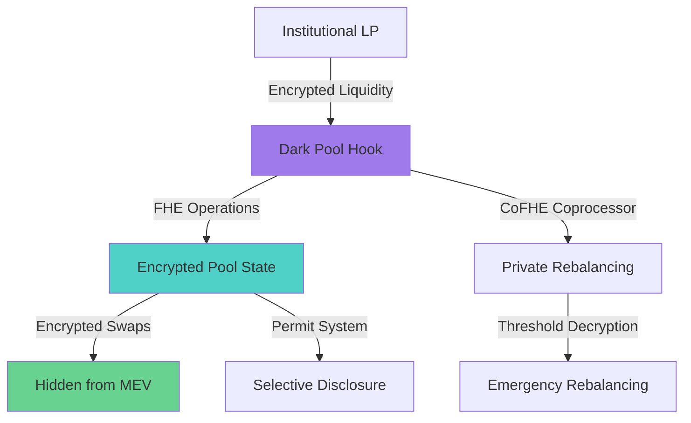
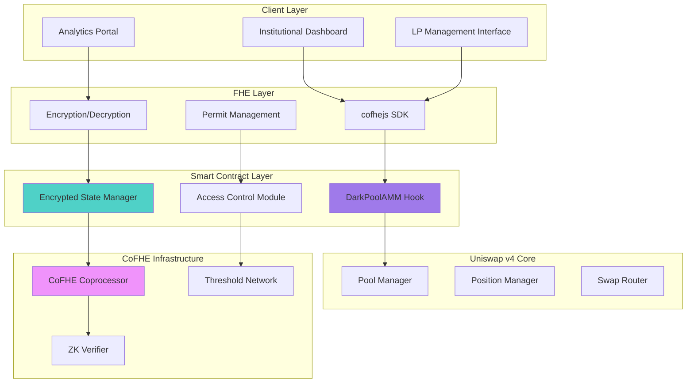
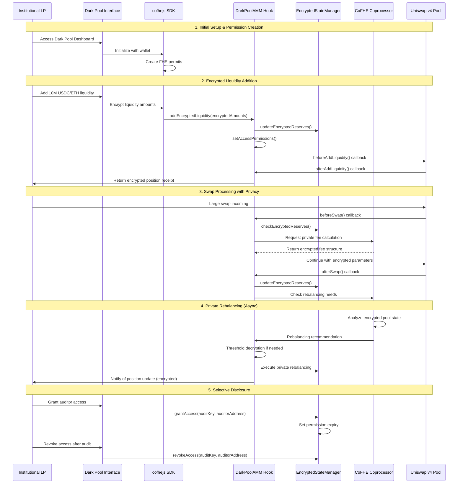
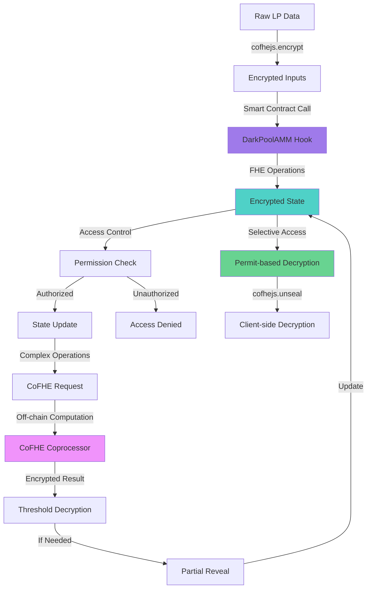
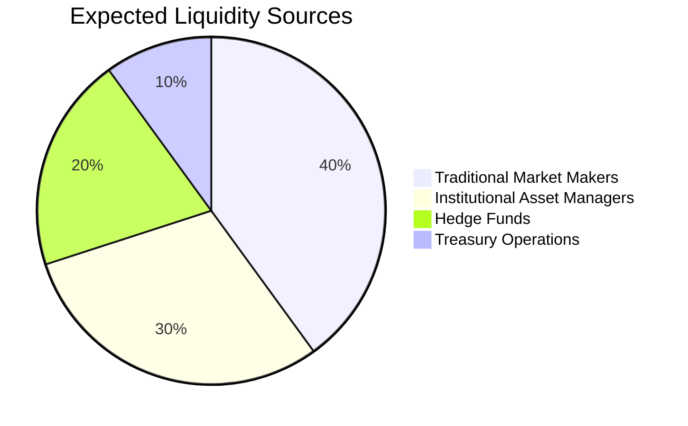

# Dark Pool AMM Hook 🌊🔒

> **Institutional-grade privacy for large liquidity providers without sacrificing DeFi composability**

Bringing confidential liquidity provisioning to Uniswap v4 through Fully Homomorphic Encryption (FHE), enabling traditional market makers and institutions to participate in DeFi while maintaining trade privacy and MEV protection.


---

## 🎯 Problem Statement

### The $10B+ Institutional Liquidity Gap

Traditional financial institutions and large market makers avoid DeFi due to **critical privacy concerns**:

- **📊 MEV Exposure**: Large trades are frontrun, causing significant slippage
- **🔍 Strategy Leakage**: Institutional trading strategies become public knowledge
- **⚡ Timing Attacks**: Competitors can predict and counter institutional moves
- **🏛️ Regulatory Compliance**: Many institutions require trade confidentiality
- **💰 Competitive Disadvantage**: Public mempool reveals valuable trading intentions

**Result**: Over $10 billion in institutional liquidity remains in traditional markets, unable to benefit from DeFi's composability and efficiency.

### Current DeFi Limitations

Existing AMMs expose all liquidity operations:
- ✅ Transparent and auditable
- ❌ No privacy protection for large LPs
- ❌ MEV vulnerability for institutional-size trades
- ❌ Strategy leakage prevents sophisticated market making
- ❌ Regulatory barriers for institutional adoption

---

## 🔒 Solution: Dark Pool AMM Hook

### Revolutionary Privacy-Preserving Liquidity

Our **Dark Pool AMM Hook** leverages **Fully Homomorphic Encryption (FHE)** to enable:

- **🔐 Confidential Liquidity**: LP amounts, reserves, and fees remain encrypted on-chain
- **🛡️ MEV Protection**: Trading strategies hidden from frontrunners and sandwichers  
- **⚡ Real-time Privacy**: Instant encrypted operations without sacrificing speed
- **🏗️ DeFi Composability**: Full integration with existing Uniswap v4 ecosystem
- **🔓 Selective Disclosure**: Institutional LPs control who can access their data

### How FHE Solves the Privacy Problem



**Key Innovation**: All sensitive data (liquidity amounts, fees, rebalancing algorithms) remain encrypted while still enabling efficient AMM operations.

---

## 🏗️ Architecture Overview

### System Components



### Core Architecture Principles

1. **🔐 Privacy by Design**: All sensitive data encrypted at rest and in computation
2. **⚡ Performance Optimized**: Gas-efficient FHE operations with batch processing
3. **🔄 Async Workflows**: CoFHE coprocessor handles complex computations off-chain
4. **🎯 Granular Access**: Fine-grained permission system for institutional compliance
5. **🔧 Modular Design**: Composable components for different institutional needs

---

## 📁 Project Structure

```
dark-pool-amm-hook/
├── 📁 src/
│   ├── 📄 DarkPoolAMM.sol                 # Main hook contract
│   ├── 📄 EncryptedStateManager.sol       # FHE state management
│   ├── 📄 AccessControlModule.sol         # Permission management
│   ├── 📄 PrivateRebalancer.sol          # CoFHE rebalancing logic
│   ├── 📄 interfaces/
│   │   ├── 📄 IDarkPoolAMM.sol           # Hook interface
│   │   ├── 📄 IEncryptedState.sol        # State interface
│   │   └── 📄 IPrivateRebalancer.sol     # Rebalancer interface
│   └── 📄 libraries/
│       ├── 📄 FHEMath.sol                # FHE mathematical operations
│       ├── 📄 EncryptedLiquidity.sol     # LP position management
│       └── 📄 PrivacyUtils.sol           # Privacy helper functions
├── 📁 test/
│   ├── 📄 DarkPoolAMM.t.sol              # Comprehensive hook tests
│   ├── 📄 EncryptedOperations.t.sol      # FHE operation tests
│   ├── 📄 AccessControl.t.sol            # Permission system tests
│   ├── 📄 Integration.t.sol              # Full integration tests
│   └── 📄 utils/
│       ├── 📄 FHETestHelper.sol          # FHE testing utilities
│       ├── 📄 MockCoprocessor.sol        # CoFHE simulation
│       └── 📄 TestFixtures.sol           # Test setup helpers
├── 📁 script/
│   ├── 📄 Deploy.s.sol                   # Deployment script
│   ├── 📄 SetupPools.s.sol              # Pool initialization
│   ├── 📄 DemoLP.s.sol                  # Demo liquidity provision
│   └── 📄 Benchmark.s.sol               # Performance benchmarks
├── 📁 frontend/
│   ├── 📁 src/
│   │   ├── 📁 components/
│   │   │   ├── 📄 DarkPoolDashboard.tsx  # Main LP interface
│   │   │   ├── 📄 EncryptedPositions.tsx # Position management
│   │   │   ├── 📄 PrivacyControls.tsx    # Access management
│   │   │   └── 📄 RebalancingPanel.tsx   # Strategy management
│   │   ├── 📁 hooks/
│   │   │   ├── 📄 useDarkPool.ts         # Hook interaction
│   │   │   ├── 📄 useEncryption.ts       # FHE operations
│   │   │   └── 📄 usePermissions.ts      # Access control
│   │   └── 📁 utils/
│   │       ├── 📄 fhe.ts                 # FHE utilities
│   │       ├── 📄 permits.ts             # Permit management
│   │       └── 📄 analytics.ts           # Privacy analytics
│   ├── 📄 package.json
│   └── 📄 next.config.js
├── 📁 docs/
│   ├── 📄 ARCHITECTURE.md               # Detailed architecture
│   ├── 📄 FHE_PATTERNS.md              # FHE implementation guide
│   ├── 📄 INSTITUTIONAL_GUIDE.md        # Institution onboarding
│   └── 📄 API_REFERENCE.md             # Complete API documentation
├── 📄 foundry.toml                      # Foundry configuration
├── 📄 package.json                      # Dependencies
├── 📄 .env.example                      # Environment template
└── 📄 README.md                         # This file
```

---

## 🔧 Dependencies & Requirements

### Core Dependencies

```toml
# foundry.toml
[dependencies]
forge-std = "^1.7.1"
v4-core = { git = "https://github.com/Uniswap/v4-core" }
v4-periphery = { git = "https://github.com/Uniswap/v4-periphery" }
cofhe-contracts = { git = "https://github.com/FhenixProtocol/cofhe-contracts" }
cofhe-mock-contracts = { git = "https://github.com/FhenixProtocol/cofhe-mock-contracts" }

[profile.default]
solc = "0.8.25"
evm_version = "cancun"
via_ir = true  # Required for FHE compilation
isolate = true # Required for FHE testing
```

```json
// package.json
{
  "dependencies": {
    "@fhenixprotocol/cofhejs": "^0.3.0",
    "@fhenixprotocol/cofhe-hardhat-plugin": "^0.2.0",
    "@uniswap/v4-sdk": "^1.0.0",
    "ethers": "^6.8.0",
    "viem": "^1.19.0",
    "wagmi": "^1.4.0"
  },
  "devDependencies": {
    "foundry-rs/foundry": "latest",
    "@types/node": "^20.0.0",
    "typescript": "^5.0.0"
  }
}
```

### System Requirements

- **Node.js**: v20+ (required for cofhejs WASM support)
- **Foundry**: Latest stable (with `--via-ir` flag support)
- **Memory**: 8GB+ RAM (for FHE compilation)
- **Network**: Fhenix testnet/mainnet or local with CoFHE mocks

---

## 🧩 Component Descriptions

### Smart Contract Components

#### **1. DarkPoolAMM.sol** - Main Hook Contract
```solidity
// Core hook implementing all Uniswap v4 lifecycle functions
contract DarkPoolAMM is BaseHook {
    // Encrypted pool state
    mapping(PoolId => euint128) private encryptedReserves0;
    mapping(PoolId => euint128) private encryptedReserves1;
    mapping(PoolId => euint64) private encryptedTotalFees;
    
    // LP position tracking
    mapping(address => mapping(PoolId => euint128)) private encryptedPositions;
    
    // Hook permissions: all lifecycle events
    function getHookPermissions() public pure override returns (Hooks.Permissions memory);
    
    // Core hook functions with FHE integration
    function beforeAddLiquidity(...) external override;
    function afterAddLiquidity(...) external override;
    function beforeRemoveLiquidity(...) external override;
    function beforeSwap(...) external override;
    function afterSwap(...) external override;
}
```

#### **2. EncryptedStateManager.sol** - FHE State Management
```solidity
// Manages all encrypted state transitions and access control
contract EncryptedStateManager {
    // State management
    function updateEncryptedReserves(PoolId poolId, euint128 amount0, euint128 amount1) external;
    function getEncryptedPosition(PoolId poolId, address lp) external view returns (euint128);
    
    // Access control integration
    function grantAccess(euint128 encryptedValue, address user, uint256 expiry) external;
    function revokeAccess(euint128 encryptedValue, address user) external;
    
    // CoFHE integration
    function requestDecryption(euint128 value) external returns (uint256 requestId);
    function getDecryptionResult(uint256 requestId) external view returns (uint128);
}
```

#### **3. AccessControlModule.sol** - Permission Management
```solidity
// Granular access control for institutional compliance
contract AccessControlModule {
    // Permission types
    enum PermissionLevel { READ, WRITE, ADMIN }
    
    // Institutional access patterns
    mapping(address => mapping(bytes32 => PermissionLevel)) private permissions;
    mapping(bytes32 => uint256) private permissionExpiry;
    
    // Compliance features
    function grantInstitutionalAccess(address institution, bytes32[] memory dataKeys) external;
    function auditAccess(address user, bytes32 dataKey) external view returns (bool);
    function emergencyRevoke(bytes32 dataKey) external; // Only admin
}
```

#### **4. PrivateRebalancer.sol** - CoFHE Rebalancing Logic
```solidity
// Handles complex rebalancing algorithms via CoFHE coprocessor
contract PrivateRebalancer {
    // Async rebalancing workflow
    mapping(uint256 => RebalanceRequest) private pendingRebalances;
    mapping(PoolId => uint256) private lastRebalanceBlock;
    
    // Threshold-based rebalancing
    function triggerRebalanceIfNeeded(PoolId poolId, euint128 newReserve0, euint128 newReserve1) external;
    function executeRebalance(uint256 requestId) external;
    
    // Emergency mechanisms
    function emergencyRebalance(PoolId poolId, bytes32 emergencyKey) external;
    function setRebalanceThresholds(euint64 minThreshold, euint64 maxThreshold) external;
}
```

### Frontend Components

#### **1. DarkPoolDashboard.tsx** - Main Interface
```typescript
// Institutional-grade dashboard for LP management
export function DarkPoolDashboard() {
    const { positions, totalLiquidity } = useDarkPoolPositions();
    const { permissions } = usePermissions();
    
    return (
        <div className="dark-pool-dashboard">
            <EncryptedMetrics />
            <PositionManagement />
            <PrivacyControls />
            <RebalancingPanel />
        </div>
    );
}
```

#### **2. EncryptedPositions.tsx** - Position Management
```typescript
// Handles encrypted LP position display and management
export function EncryptedPositions() {
    const { encryptedPositions, decrypt } = useEncryptedPositions();
    
    return (
        <div className="positions-grid">
            {encryptedPositions.map(position => (
                <EncryptedPositionCard
                    key={position.id}
                    position={position}
                    onDecrypt={decrypt}
                />
            ))}
        </div>
    );
}
```

---

## 🔄 System Flow Diagram

### Complete Dark Pool AMM Workflow



### Technical Data Flow



---

## 🚀 Quick Start

### 1. Installation

```bash
# Clone repository
git clone https://github.com/your-org/dark-pool-amm-hook
cd dark-pool-amm-hook

# Install dependencies
foundryup                    # Update Foundry
npm install                  # Install JS dependencies
forge install               # Install Solidity dependencies
```

### 2. Local Development

```bash
# Start local Fhenix node with CoFHE mocks
yarn chain

# Deploy contracts
forge script script/Deploy.s.sol --via-ir --broadcast

# Run tests
forge test --via-ir -vvv

# Start frontend
cd frontend && npm run dev
```

### 3. Demo Usage

```bash
# Setup demo pools
forge script script/SetupPools.s.sol --via-ir --broadcast

# Add demo institutional liquidity
forge script script/DemoLP.s.sol --via-ir --broadcast

# Run benchmarks
forge script script/Benchmark.s.sol --via-ir
```

---

## 📊 Success Metrics & Impact

### Quantifiable Success Metrics

- **📈 TVL Growth**: Target $100M+ TVL from institutional LPs within 6 months
- **🛡️ MEV Protection**: >95% reduction in frontrunning losses for large trades
- **⚡ Gas Efficiency**: <15% gas overhead compared to standard Uniswap v4 pools
- **🔒 Privacy Guarantees**: Zero information leakage about LP strategies/amounts
- **🏛️ Institutional Adoption**: 10+ traditional market makers onboarded

### Market Impact Projections



**Total Addressable Market**: $10B+ in institutional liquidity currently avoiding DeFi due to privacy concerns.

---

## 🔮 Future Roadmap

### Phase 1: Core Implementation (UHI6 Hackathon)
- ✅ Basic FHE hook with encrypted liquidity
- ✅ CoFHE integration for rebalancing
- ✅ Simple permit-based access control
- ✅ Frontend proof-of-concept

### Phase 2: Institutional Features (Post-Hackathon)
- 🔄 Advanced compliance tools
- 🔄 Multi-party computation for shared pools
- 🔄 Cross-chain encrypted state sync
- 🔄 Professional trading interfaces

### Phase 3: Ecosystem Integration
- 🔄 Integration with major DeFi protocols
- 🔄 Institutional custody solutions
- 🔄 Regulatory reporting tools
- 🔄 Traditional finance bridges

---

## 🤝 Contributing

We welcome contributions from the DeFi and privacy communities! See [CONTRIBUTING.md](./CONTRIBUTING.md) for guidelines.

### Development Guidelines

1. **Privacy First**: All new features must maintain confidentiality guarantees
2. **Gas Optimization**: FHE operations must be gas-efficient
3. **Testing Required**: Comprehensive tests for all FHE operations
4. **Documentation**: Clear documentation for institutional users

---

## 📜 License

MIT License - see [LICENSE](./LICENSE) for details.

---

## 🙏 Acknowledgments

- **Fhenix Protocol** for revolutionary FHE infrastructure
- **Uniswap v4** for composable AMM architecture  
- **EigenLayer** for restaking security in CoFHE
- **UHI Program** for fostering innovation in DeFi

---

**Built with ❤️ for the future of private DeFi**

*Bringing institutional capital to DeFi while preserving the privacy and strategy protection that professional market makers require.*
